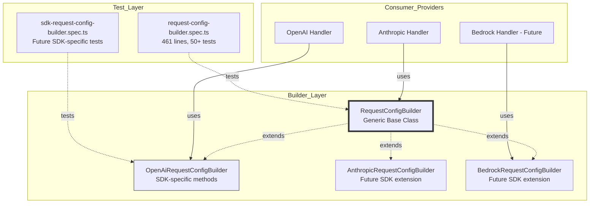

# RequestConfigBuilder

A generic, SDK-agnostic request configuration builder that provides a fluent API for building type-safe request configurations. Designed to work with any HTTP client SDK (OpenAI, AWS Bedrock, Anthropic, Vertex AI, etc.) through TypeScript generics and inheritance.

## Table of Contents

- [Overview](#overview)
    - [Multi-SDK Usage Matrix](#multi-sdk-usage-matrix)
    - [Generic Methods vs SDK-Specific Methods](#generic-methods-vs-sdk-specific-methods)
- [Architecture Diagram](#architecture-diagram)
- [Quick Start](#quick-start)
    - [Scenario 1: Basic Usage from Metadata](#scenario-1-basic-usage-from-metadata)
    - [Scenario 2: Chainable Configuration](#scenario-2-chainable-configuration)
    - [Scenario 3: Merging Multiple Abort Signals](#scenario-3-merging-multiple-abort-signals)
- [Deep Dive: Abort Signal Handling](#deep-dive-abort-signal-handling)
    - [Why Abort Signals Matter](#why-abort-signals-matter)
    - [How `addAbortSignal` Works](#how-addabortsignal-works)
    - [How `mergeAbortSignals` Works](#how-mergeabortsignals-works)
- [Generic Design](#generic-design)
- [Multi-SDK Usage Examples](#multi-sdk-usage-examples)
- [Extending for Your SDK](#extending-for-your-sdk)
- [Test Strategy](#test-strategy)
- [API Reference](#api-reference)
    - [Instance Methods](#instance-methods)
    - [Static Methods](#static-methods)
- [Breaking Changes Analysis](#breaking-changes-analysis)
- [Design Principles](#design-principles)

---

## Overview

`RequestConfigBuilder` is a **generic, SDK-agnostic request configuration builder** that provides:

1. **Unified Interface** - Consistent request configuration building across all SDKs (OpenAI, AWS Bedrock, Anthropic, Vertex AI, etc.)
2. **Chainable Calls** - Fluent API style for concise, readable code
3. **Generic Type Support** - TypeScript generics (`TOptions`) for type-safe SDK adaptation
4. **Extensibility** - Easily add support for new SDKs by creating extended classes with SDK-specific methods

### Multi-SDK Usage Matrix

| SDK         | Usage Pattern                                                                          | Options Type               | Extended Class                           |
| ----------- | -------------------------------------------------------------------------------------- | -------------------------- | ---------------------------------------- |
| OpenAI      | `OpenAiRequestConfigBuilder extends RequestConfigBuilder<OpenAI.RequestOptions>`       | `OpenAI.RequestOptions`    | `OpenAiRequestConfigBuilder` (example)   |
| AWS Bedrock | `BedrockRequestConfigBuilder extends RequestConfigBuilder<BedrockInvokeOptions>`       | SDK-specific type          | `BedrockRequestConfigBuilder` (future)   |
| Anthropic   | `AnthropicRequestConfigBuilder extends RequestConfigBuilder<Anthropic.RequestOptions>` | `Anthropic.RequestOptions` | `AnthropicRequestConfigBuilder` (future) |
| Vertex AI   | `VertexAiRequestConfigBuilder extends RequestConfigBuilder<VertexAiOptions>`           | Custom interface           | `VertexAiRequestConfigBuilder` (future)  |

### Generic Methods vs SDK-Specific Methods

| Category                         | Methods                                                           | Scope             | Implementation Location                               |
| -------------------------------- | ----------------------------------------------------------------- | ----------------- | ----------------------------------------------------- |
| **Generic Methods** (Base Class) | `addAbortSignal`, `addHeaders`, `setOption`, `getOption`, `build` | All SDKs          | [`RequestConfigBuilder`](./request-config-builder.ts) |
| **Static Methods**               | `fromMetadata`, `mergeAbortSignals`                               | All SDKs          | [`RequestConfigBuilder`](./request-config-builder.ts) |
| **SDK-Specific Methods**         | `addPath`, `addQueryParams` (OpenAI), `addModelId` (Bedrock)      | Specific SDK only | Extended classes                                      |

---

## Architecture Diagram



---

## Quick Start

### Scenario 1: Basic Usage from Metadata

```typescript
import { RequestConfigBuilder } from "./request-config-builder"

// Create a configuration quickly from metadata with extra options
const config = RequestConfigBuilder.fromMetadata(metadata, { timeout: 5000 })
```

This is equivalent to the following manual process:

```typescript
const builder = new RequestConfigBuilder<{ timeout: number; signal?: AbortSignal }>({ timeout: 5000 })
builder.addAbortSignal(metadata)
const config = builder.build()
```

### Scenario 2: Chainable Configuration

```typescript
import { RequestConfigBuilder } from "./request-config-builder"

const builder = new RequestConfigBuilder<{ url: string; headers?: Record<string, string>; signal?: AbortSignal }>()
const config = builder.addHeaders({ "X-Custom-Header": "value" }).setOption("url", "https://api.example.com").build()
```

All `add*` and `setOption` methods return `this`, enabling fluent chainable calls.

### Scenario 3: Merging Multiple Abort Signals

```typescript
import { RequestConfigBuilder } from "./request-config-builder"

const mergedSignal = RequestConfigBuilder.mergeAbortSignals(primarySignal, secondarySignal)
```

When either signal is aborted, the returned signal will also be aborted.

---

## Deep Dive: Abort Signal Handling

Abort signals are a core feature of `RequestConfigBuilder`. This section explains how they work in detail.

### Why Abort Signals Matter

In HTTP requests, abort signals allow you to cancel in-flight requests. This is essential for:

- **User experience**: Cancel long-running requests when the user navigates away
- **Resource management**: Free up network connections and memory
- **Race condition prevention**: Cancel stale requests when a new one is triggered

### How `addAbortSignal` Works

The `addAbortSignal` method extracts an abort signal from metadata and adds it to the configuration:

```typescript
// Usage
builder.addAbortSignal(metadata)
```

**Behavior breakdown:**

1. If `metadata` is `undefined`, do nothing and return `this`
2. If `metadata.abortSignal` is `undefined`, do nothing and return `this`
3. Otherwise, set `options.signal = metadata.abortSignal`

**Internal implementation:**

```typescript
addAbortSignal(metadata?: ApiHandlerCreateMessageMetadata): this {
    if (!metadata?.abortSignal) {
        return this  // Early exit: no signal to add
    }

    // Add the signal to options (returns new object for immutability)
    this.options = { ...this.options, signal: metadata.abortSignal } as TOptions
    return this  // Enable chaining
}
```

**Example with real metadata:**

```typescript
// Metadata from API handler creation
const metadata: ApiHandlerCreateMessageMetadata = {
	abortSignal: new AbortController().signal,
	// ... other properties
}

// Add the signal to configuration
const config = new RequestConfigBuilder()
	.addAbortSignal(metadata) // Signal is now in options.signal
	.build()
```

### How `mergeAbortSignals` Works

The static `mergeAbortSignals` method combines two abort signals into one. When **either** signal is aborted, the returned signal will be aborted:

```typescript
static mergeAbortSignals(primarySignal: AbortSignal, secondarySignal?: AbortSignal): AbortSignal {
    if (!secondarySignal) {
        return primarySignal
    }

    // If secondary is already aborted, we need to return a signal that reflects this.
    // We can't just return primarySignal because it might not be aborted yet.
    if (secondarySignal.aborted) {
        if (primarySignal.aborted) {
            return primarySignal
        }
        // Create a new controller that's already aborted to reflect secondary's state
        const controller = new AbortController()
        controller.abort()
        return controller.signal
    }

    if (primarySignal.aborted) {
        return primarySignal
    }

    const controller = new AbortController()

    // Listen for abort events on both signals
    primarySignal.addEventListener("abort", () => controller.abort(), { once: true })
    secondarySignal.addEventListener("abort", () => controller.abort(), { once: true })

    return controller.signal
}
```

**Behavior breakdown:**

| Condition                                                          | Result                                                 |
| ------------------------------------------------------------------ | ------------------------------------------------------ |
| `secondarySignal` is `undefined`                                   | Return `primarySignal` unchanged                       |
| `secondarySignal` is already aborted, `primarySignal` also aborted | Return `primarySignal` (already aborted)               |
| `secondarySignal` is already aborted, `primarySignal` active       | Return NEW aborted signal to reflect secondary's state |
| `primarySignal` is already aborted, `secondarySignal` active       | Return `primarySignal` (already aborted)               |
| Both signals are active                                            | Return new signal that aborts when either fires        |

**Usage example:**

```typescript
// Create two independent signals
const userAbortController = new AbortController()
const timeoutController = new AbortController()

// Merge them into one
const mergedSignal = RequestConfigBuilder.mergeAbortSignals(userAbortController.signal, timeoutController.signal)

// Now aborting either controller will trigger the merged signal
userAbortController.abort() // mergedSignal.aborted === true
```

---

## Generic Design

### Type Parameter

```typescript
export class RequestConfigBuilder<
    TOptions extends Record<string, any> = Record<string, any>
>
```

| Parameter  | Type                  | Default               | Description                          |
| ---------- | --------------------- | --------------------- | ------------------------------------ |
| `TOptions` | `Record<string, any>` | `Record<string, any>` | SDK-specific options type constraint |

### Design Rationale

The generic design enables:

1. **Type Safety** - TypeScript enforces correct option types at compile time
2. **SDK Isolation** - Each SDK's specific options are encapsulated in their own type
3. **Code Reuse** - Common logic (signal handling, header merging) lives in the base class
4. **Zero Runtime Overhead** - Generics are erased at compile time, no runtime cost

---

## Multi-SDK Usage Examples

### Scenario A: OpenAI SDK - Using Extended Class

```typescript
import { OpenAiRequestConfigBuilder } from "./openai-request-config-builder"

const config = new OpenAiRequestConfigBuilder()
	.addAbortSignal(metadata)
	.addPath("/v1/chat/completions")
	.addQueryParams({ stream: true })
	.addHeaders({ "X-API-Key": "secret" })
	.build()

await client.chat.completions.create(requestOptions, config)
```

### Scenario B: AWS Bedrock SDK - Using Generic Base Class with setOption

```typescript
import { RequestConfigBuilder } from "./request-config-builder"

type BedrockOptions = {
	modelId?: string
	maxTokens?: number
	body?: string
	signal?: AbortSignal
}

const config = new RequestConfigBuilder<BedrockOptions>()
	.addAbortSignal(metadata)
	.setOption("modelId", "anthropic.claude-3-opus-20240229-v1:0")
	.setOption("maxTokens", 2000)
	.build()

await bedrockClient.invoke(config)
```

### Scenario C: Anthropic SDK - Using Extended Class (Future)

```typescript
import { AnthropicRequestConfigBuilder } from "./anthropic-request-config-builder"

const config = new AnthropicRequestConfigBuilder()
	.addAbortSignal(metadata)
	.setApiVersion("2023-06-01")
	.addHeaders({ "X-Anthropic-Beta": "prompt-caching-20240715" })
	.build()

await anthropic.messages.create(requestOptions, config)
```

### Scenario D: Quick Factory Method (All SDKs)

```typescript
import { RequestConfigBuilder } from "./request-config-builder"

// Simplest usage - just add signal + extra options
const config = RequestConfigBuilder.fromMetadata(metadata, {
	timeout: 5000,
	retryCount: 3,
})
```

### Scenario E: Merging External Signals (All SDKs)

```typescript
import { RequestConfigBuilder } from "./request-config-builder"

// Provider creates internal AbortController
this.abortController = new AbortController()

// Merge external signal - works with all SDKs
const mergedSignal = RequestConfigBuilder.mergeAbortSignals(
    this.abortController.signal,
    metadata?.abortSignal,
)

// Use with any SDK
await client.request({ signal: mergedSignal, ... })
```

---

## Extending for Your SDK

`RequestConfigBuilder` supports SDK-specific extensions via inheritance. Follow these steps to add support for a new SDK:

### Step 1: Define SDK-Specific Options Type

```typescript
// my-sdk-options.ts
export interface MySdkOptions {
	signal?: AbortSignal
	headers?: Record<string, string>
	modelId?: string
	maxTokens?: number
}
```

### Step 2: Create Extended Builder Class

Here's an example for the OpenAI SDK:

```typescript
import { RequestConfigBuilder } from "./request-config-builder"
import type * as OpenAI from "openai"

export class OpenAiRequestConfigBuilder extends RequestConfigBuilder<OpenAI.RequestOptions> {
	constructor(defaultOptions?: Partial<OpenAI.RequestOptions>) {
		super(defaultOptions)
	}

	addPath(path: string | undefined): this {
		if (path) {
			this.options = { ...this.options, path } as OpenAI.RequestOptions
		}
		return this
	}

	addQueryParams(params: Record<string, any>): this {
		if (Object.keys(params).length > 0) {
			this.options = { ...this.options, queryParams: params } as OpenAI.RequestOptions
		}
		return this
	}
}
```

### Step 3: Add SDK-Specific Tests

```typescript
// my-sdk-request-config-builder.spec.ts
import { describe, test, expect } from "vitest"
import { MySdkRequestConfigBuilder } from "./my-sdk-request-config-builder"

describe("MySdkRequestConfigBuilder", () => {
	test("addModelId sets model ID", () => {
		const builder = new MySdkRequestConfigBuilder()
		const result = builder.addModelId("my-model-123")

		expect(result).toBe(builder) // chainable
		const config = builder.build()
		expect(config?.modelId).toBe("my-model-123")
	})
})
```

### Step 4: Update Documentation

Add usage examples in this document's Multi-SDK section.

### Key Extension Patterns

| Pattern                    | Description                                                                                      |
| -------------------------- | ------------------------------------------------------------------------------------------------ |
| **Generic type parameter** | Pass your SDK's options type (e.g., `OpenAI.RequestOptions`) to `RequestConfigBuilder<TOptions>` |
| **SDK-specific methods**   | Add methods like `addPath`, `addModelId`, `setApiVersion` for SDK-specific configuration         |
| **Type casting**           | Use `as YourSdkOptionsType` when assigning merged objects back to `this.options`                 |
| **Delegation to base**     | Use `this.setOption()` for simple options, direct `this.options` assignment for complex merges   |

---

## Test Strategy

### Test Coverage Overview

| Test File                                                                       | Lines | Test Category            | Test Count |
| ------------------------------------------------------------------------------- | ----- | ------------------------ | ---------- |
| [`request-config-builder.spec.ts`](../__tests__/request-config-builder.spec.ts) | 461   | Generic + Static Methods | ~50+       |

### Test Categories

| Category          | Test Count | Coverage                                            |
| ----------------- | ---------- | --------------------------------------------------- |
| constructor       | 3          | Empty init, default options, shallow copy           |
| addAbortSignal    | 5          | Normal case, undefined metadata, signal replacement |
| addHeaders        | 6          | Merge, override, create new object                  |
| setOption         | 5          | Type safety, undefined handling                     |
| getOption         | 2          | Get value, non-existent key                         |
| build             | 4          | Shallow copy, empty options, immutability           |
| fromMetadata      | 5          | Various combination scenarios                       |
| mergeAbortSignals | 8          | Primary only, merged, abort events                  |
| integration       | 3          | Full lifecycle, custom types                        |

### Running Tests

```bash
cd src && npx vitest run api/providers/__tests__/request-config-builder.spec.ts
```

---

## Breaking Changes Analysis

| Change Type                                   | Breaking | Description                                                          |
| --------------------------------------------- | -------- | -------------------------------------------------------------------- |
| Adding generic parameter TOptions             | No       | Default value `Record<string, any>` maintains backward compatibility |
| Adding setOption method                       | No       | Existing code unaffected                                             |
| Modifying fromMetadata to be generic          | No       | TypeScript type inference remains compatible                         |
| options access modifier (private → protected) | Partial  | Only affects extended classes, not direct users                      |

---

## API Reference

### Instance Methods

| Method           | Parameters                                   | Returns                    | Description                                                                                                       |
| ---------------- | -------------------------------------------- | -------------------------- | ----------------------------------------------------------------------------------------------------------------- |
| `addAbortSignal` | `metadata?: ApiHandlerCreateMessageMetadata` | `this`                     | Add an abort signal from metadata. Skips if metadata or abortSignal is undefined.                                 |
| `addHeaders`     | `headers: Record<string, string>`            | `this`                     | Add or merge custom headers. Empty objects are skipped. Headers are merged (not replaced).                        |
| `setOption`      | `key: K, value: TOptions[K]`                 | `this`                     | Set a single option in a type-safe way. Skips if value is undefined.                                              |
| `getOption`      | `key: K`                                     | `TOptions[K] \| undefined` | Get an option value by key. Returns undefined if not set.                                                         |
| `build`          | —                                            | `TOptions \| undefined`    | Build the final configuration. Returns a shallow copy for immutability. Returns undefined if no options were set. |

### Static Methods

| Method              | Parameters                                                                     | Returns                 | Description                                                                                                                                                                 |
| ------------------- | ------------------------------------------------------------------------------ | ----------------------- | --------------------------------------------------------------------------------------------------------------------------------------------------------------------------- |
| `fromMetadata`      | `metadata?: ApiHandlerCreateMessageMetadata, extraOptions?: Partial<TOptions>` | `TOptions \| undefined` | Factory method that creates a builder from metadata and optional extra options. Combines `new RequestConfigBuilder(extraOptions)` + `addAbortSignal(metadata)` + `build()`. |
| `mergeAbortSignals` | `primarySignal: AbortSignal, secondarySignal?: AbortSignal`                    | `AbortSignal`           | Merge two abort signals into one. The returned signal aborts when either input signal aborts.                                                                               |

---

## Design Principles

1. **Immutability**: `build()` returns a shallow copy of internal options
2. **Defensive programming**: Empty/undefined values are skipped (not added to config)
3. **Chainable interface**: All mutation methods return `this` for fluent API style
4. **Generic type safety**: TypeScript generics ensure SDK-specific types are enforced at compile time
